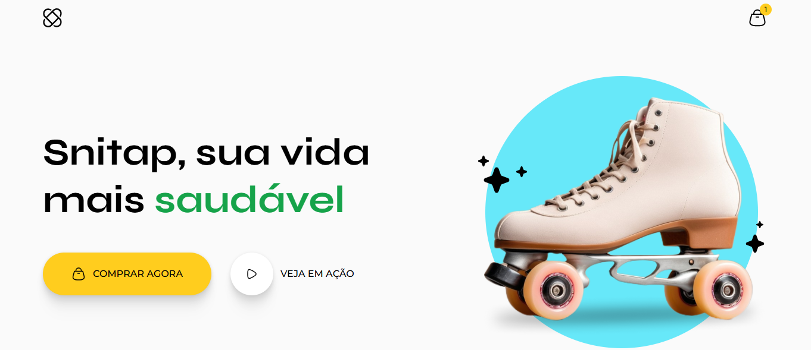
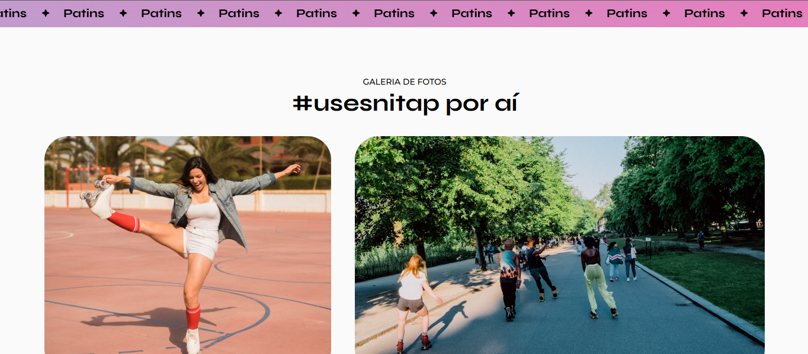

# 🛼 Snitap - Sua Vida Mais Radical

**Landing page responsiva** para patins Snitap, desenvolvida com HTML e CSS, incluindo animações interativas.

## ✨ Destaques
-  Design moderno e impactante
-  Animações fluidas em CSS
-  Galeria de fotos interativa
-  Totalmente responsivo (mobile-first)

## 🛠️ Tecnologias

  
  

## 🎨 Preview

  
  

## 🌐 Acesse o projeto

🔍 **Todos meus projetos**: [github.com/luizacavalcantee](https://github.com/luizacavalcantee)

💌 **Contato**: cavalcanteluiza13@gmail.com | [LinkedIn](https://www.linkedin.com/in/luizacavalcanteee/)
